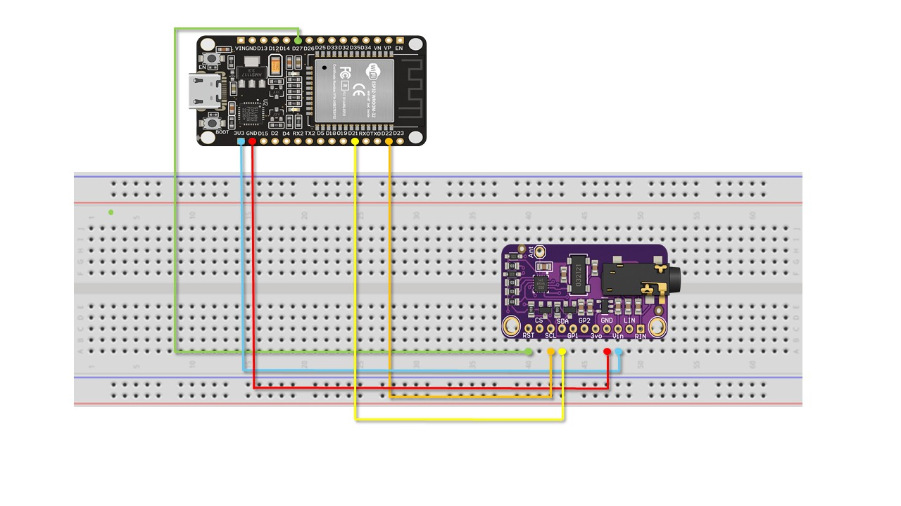
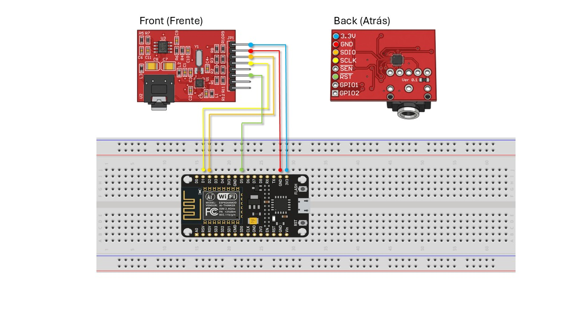
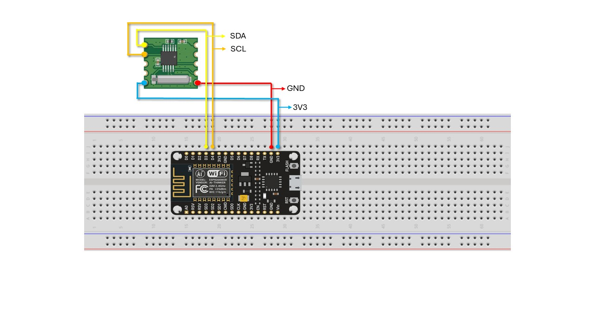

*Read this in other languages: [Português](README.pt-br.md)*
# rds-async-transmission
> *An open-source Out-of-Band (OOB) communication system for IoT/embedded devices using the 57 kHz FM subcarrier (RDS) via ESP32 and Java.*

# 📻 Asynchronous Out-of-Band Transmission via RDS for Embedded Systems

This repository contains the source code (software and firmware) and hardware replication instructions for the research project **"Using the FM Infrastructure as a Control Channel via RDS"**, submitted to the ACM.

The system proposes a resilient, low-cost communication infrastructure using the 57 kHz FM radio subcarrier (RDS) to send character strings to embedded devices without requiring IP (Internet) connectivity. 

This repository includes the implementation of the Java Orchestrator (Injection Terminal) and the firmwares containing the stability mechanisms (Dynamic *Padding*) and heuristic noise filtering.

---

## 🛠️ Hardware Requirements

To replicate this experiment, you will need the following COTS (*Commercial Off-The-Shelf*) components:

**Transmitter Node (TX):**
* 1x ESP32 Microcontroller
* 1x Adafruit Si4713 FM Transmitter
* Jumper wires

**Receiver Node (RX):**
* 1x ESP8266 Microcontroller (NodeMCU)
* 1x SparkFun Si4703 FM Receiver (or equivalent module supported by the SI470X library)
* 1x P2 audio cable (used passively in the headphone jack to act as an antenna on the ground loop)

---

## 🔌 Connection Diagram (Pinout)
It is important to emphasize that for better visualization, there is an illustrative diagram in the `Data/` directory containing each of the schematic tables below, as well as their respective tables attached to this replication manual:

### Transmitter Connections (ESP32 + Si4713)
><p align="left">
>  
></p>
>
> **📌 Pin Mapping (Pinout)**
> 
> The table below details the physical connections illustrated in the top assembly diagram:
>
> | ESP32 (Host) | Si4713 (Module) | Technical Function |
> | :--- | :--- | :--- |
> | **3V3** | `VIN` | Power Supply (3.3V) |
> | **GND** | `GND` | Ground Reference |
> | **D21** | `SDA` | I2C Bus Data |
> | **D22** | `SCL` | I2C Bus Clock |
> | **D27** | `RST` | Hardware Reset Control |

### Receiver Connections (ESP8266 + Si4703)
><p align="left">
>  
></p>
>
>| ESP8266 Pin | Si4703 Pin | Function |
>| :--- | :--- | :--- |
>| 3V3 | 3.3V | Power Supply |
>| GND | GND | Ground |
>| D2 | SDIO | I2C Data |
>| D1 | SCLK | I2C Clock |
>| D5 | RST | Hardware Reset |

### Secondary Receiver (ESP8266 + RDA 5807M)
><p align="left">
>  
></p>
>
>| ESP8266 Pin | RDA 5807M Pin | Function |
>| :--- | :--- | :--- |
>| 3V3 | VIN | Power Supply |
>| GND | GND | Ground |
>| D3 | SCL | I2C Clock |
>| D4 | SDA | I2C Data |

---

## 💻 Installation and Execution

### Step 1: Preparing the Hardware (Firmwares)
1. **USB Driver Installation:** Ensure your operating system has the appropriate drivers for serial communication. The NodeMCU (ESP8266) commonly requires the [**Silicon Labs CP210x USB to UART Bridge driver**](https://www.silabs.com/software-and-tools/usb-to-uart-bridge-vcp-drivers?tab=downloads). If the initial driver does not work, try installing the [CH340 driver](https://sparks.gogo.co.nz/ch340.html).
2. Open the Arduino IDE.
3. Make sure to install the following libraries via the Library Manager:
   * `Adafruit Si4713 Library` (For the Transmitter node)
   * `PU2CLR SI470X` (For the Receiver node)
4. Connect the **ESP32**, open the code located in the `Firmware-TX/Si4713` folder, compile, and upload it.
5. Connect the **ESP8266**, open the code located in the `Firmware-RX/Si4703` folder, compile, and upload it.

### ⚠️ Compilation Note and I2C Conflicts (Troubleshooting)
Due to architectural differences between the traditional AVR family and the Espressif family (ESP32/ESP8266), an overlap/conflict in the I2C bus pin allocation by the original libraries may occur. 

**If the transceiver is not detected in the serial monitor (Error on ESP8266 + SI470X):**
1. Navigate to the Arduino IDE libraries folder (typically in `Documents/Arduino/libraries/`).
2. Inside the `libraries/src` folder, look for the `PU2CLR_SI470X` folder. Open the `SI470X.cpp` source file of the receiver library.
3. Locate the `Wire.end();` instruction within the initialization/setup method and **comment it out** (by adding `//` at the beginning of the line). 
4. Save the file and recompile. This will prevent the library from terminating the bus prematurely and force it to respect the pins (`D2` and `D1`) defined by your *firmware*.


### Step 2: The Java Orchestrator
The Orchestrator was developed in Java with a Swing graphical user interface and managed via Maven.
1. Install Java JDK 23 (or higher) and Maven on your machine.
2. Download the source code of this repository (via the `.zip` file provided by the review platform) and extract it on your machine.
3. Navigate to the `Java-Orquestrador` folder.
4. The project uses the `jSerialComm` library for asynchronous USB communication. The dependency is already configured in the `pom.xml`.
5. Run the application via an IDE (such as VS Code, IntelliJ, Eclipse) or the command line.

### Step 3: Operating the System
1. Power the ESP8266 (Receiver) via USB (for power only) or a battery. Run the Java application and connect to the port corresponding to the RX (receiver).

2. Connect the ESP32 (Transmitter) to the USB port of your primary computer.

3. Open the Java Orchestrator, select the COM port corresponding to the Transmitter, and click "CONNECT".

4. The interface will perform an Active Handshake, identify the terminal (whether it is a receiver or a transmitter), and enable the text field for string injection to the transmitter; otherwise, the Java app will activate the passive RDS listening mode.

5. Type a payload and send it. The data will be encapsulated into 64 bytes, transmitted at 106.1 MHz, received by the remote node, filtered by the Digital Broom (*Vassoura Digital*), and displayed with full integrity.

## 📄 License
This project is licensed under the GNU GPLv3 License - see the LICENSE file for details.

## 📖 Citation
*(Note: Authorship and institutional affiliation information have been suppressed to ensure the integrity of the double-blind review. The full citation will be made available in the final camera-ready version upon acceptance).*

```bibtex
@inproceedings{Anonimo2026RDS,
  author = {Authors Omitted for Double-Blind Review},
  title = {Using the FM Infrastructure as a Control Channel via RDS},
  year = {2026},
  publisher = {ACM},
  booktitle = {Proceedings of the ACM Conference (Under Review)}
}
